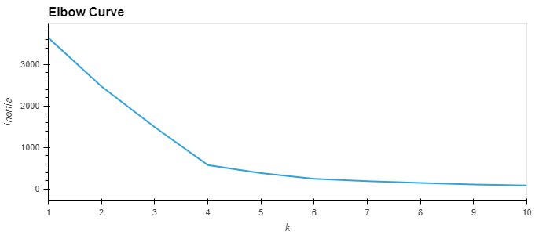
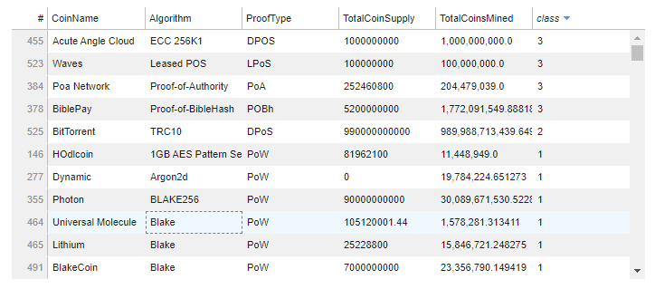
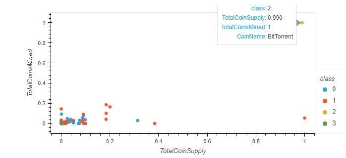

# Cryptocurrencies

Module 18 Challenge - Bootcamp: CU-VIRT-DATA-PT-02-2021-U-B-TTH - Paul Do

## Overview:

- Deliverable 1: Preprocessing the Data for PCA, Reducing Data Dimensions Using PCA

  * Principal component analysis (PCA) is used to limit features and speed up the model. We want the data to be transformed graphed as to be a best-fitting line that is defined as one that minimizes the average squared distance from the points to the line.

- Deliverable 3: Clustering Cryptocurrencies Using K-means

  * K-Means is an algorithm to group data into K clusters, where the data is clustered based on some similarity or distance to a centroid.

  * Using the Elbow Curve to determine the best value for K.

- Deliverable 4: Visualizing Cryptocurrencies Results

  Using hvplot table and scatterplots to show the visuals

  

Files:  [crypto_clustering.ipynb](crypto_clustering.ipynb) , dataset  [crypto_data.csv](Resources/crypto_data.csv) HTML  output: [crypto_clustering.html](Resources/crypto_clustering.html) 

## Results:

Determined the Best K value is 4 based on the "elbow"

Class 3 values use Algorithms that are not commonly used in other Cryptos

The majority of the cryptocurrencies are clustered in the lower left

HTML will have interactive Visuals: [crypto_clustering.html](Resources/crypto_clustering.html) 

## Summary:

The 3D graphs and the charts are clustered mostly in the bottom left. What would be an interesting data to add to the analysis would be kilowatt hour costs (if that data was possible to be made available)

